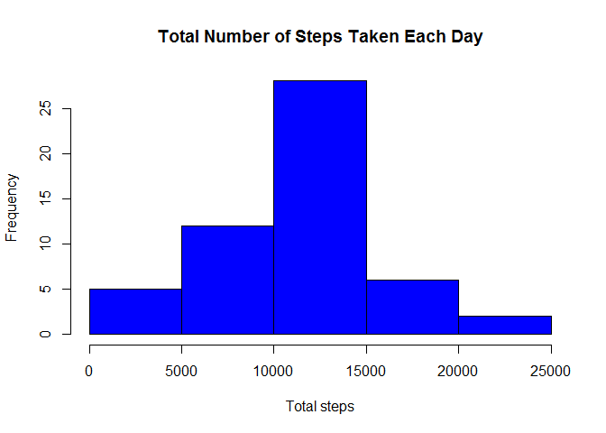
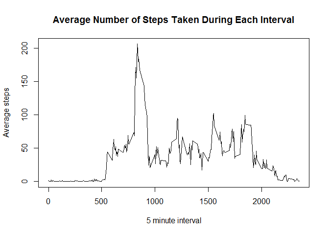
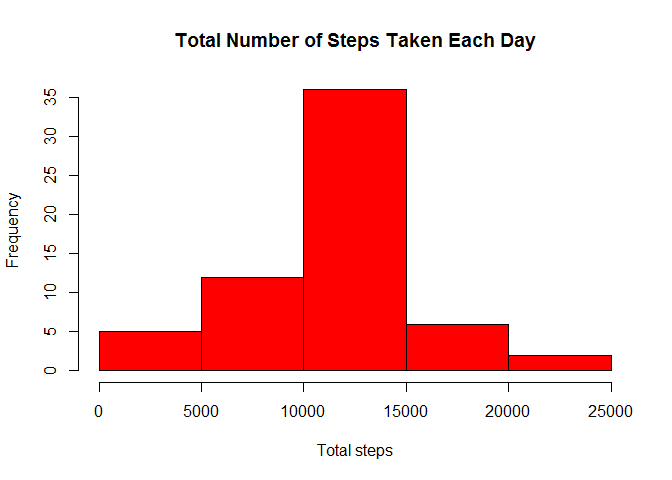
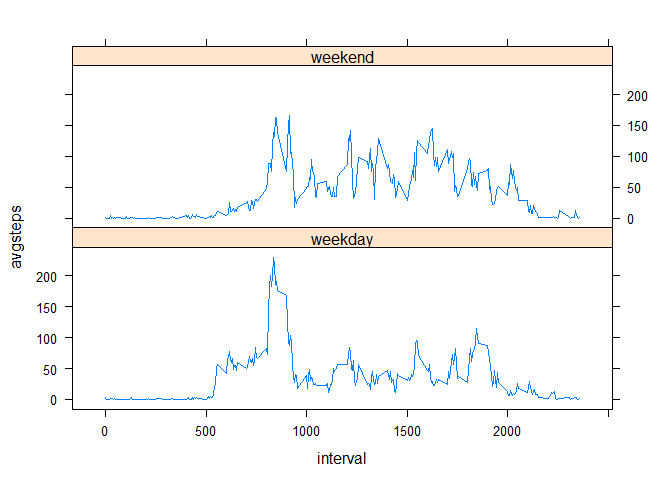

# Reproducible Research: Peer Assessment 1


## Loading and preprocessing the data
Save the Activity Monitoring dataset and set your current working directory to the location of the file.

Load the dataset into R using read.csv()

```r
activity <- read.csv("activity.csv")
```
View the data to identify any areas for preprocessing:

```r
str(activity)
```

```
## 'data.frame':	17568 obs. of  3 variables:
##  $ steps   : int  NA NA NA NA NA NA NA NA NA NA ...
##  $ date    : Factor w/ 61 levels "2012-10-01","2012-10-02",..: 1 1 1 1 1 1 1 1 1 1 ...
##  $ interval: int  0 5 10 15 20 25 30 35 40 45 ...
```
Convert the date column to date class:

```r
activity$date <- as.Date(activity$date)
summary(activity)
```

```
##      steps             date               interval     
##  Min.   :  0.00   Min.   :2012-10-01   Min.   :   0.0  
##  1st Qu.:  0.00   1st Qu.:2012-10-16   1st Qu.: 588.8  
##  Median :  0.00   Median :2012-10-31   Median :1177.5  
##  Mean   : 37.38   Mean   :2012-10-31   Mean   :1177.5  
##  3rd Qu.: 12.00   3rd Qu.:2012-11-15   3rd Qu.:1766.2  
##  Max.   :806.00   Max.   :2012-11-30   Max.   :2355.0  
##  NA's   :2304
```
Note that there 2,304 nulls in the steps column for future calculations

## What is the mean total number of steps taken per day?
Ignore missing values for this part of the assignment.

1. Make a histogram of the total number of steps taken each day

```r
library(plyr)
daysummary <- ddply(activity, "date", summarize, totalsteps=sum(steps))
hist(daysummary$totalsteps, main="Total Number of Steps Taken Each Day", xlab="Total steps", col="blue")
```

 

2. Calculate and report the **mean** and **median** total number of steps taken per day

```r
meansteps <- mean(daysummary$totalsteps, na.rm=TRUE)
meansteps
```

```
## [1] 10766.19
```

```r
mediansteps <- median(daysummary$totalsteps, na.rm=TRUE)
mediansteps
```

```
## [1] 10765
```


## What is the average daily activity pattern?
1. Make a time series plot (i.e. type = "l") of the 5-minute interval (x-axis) and the average number of steps taken, averaged across all days (y-axis)

```r
intervalsummary <- ddply(activity, "interval", summarize, avgsteps=mean(steps, na.rm=TRUE))
plot(intervalsummary$interval,intervalsummary$avgsteps, type="l", 
     xlab="5 minute interval", ylab="Average steps", main="Average Number of Steps Taken During Each Interval")
```

 

2. Which 5-minute interval, on average across all the days in the dataset, contains the maximum number of steps?

```r
maxstepsinterval <- intervalsummary[intervalsummary$avgsteps==max(intervalsummary$avgsteps),]
maxinterval <- maxstepsinterval[,1]
maxstepsperinterval <- maxstepsinterval[,2]
```
5-minute interval number **835** contains the maximum steps at **206.1698113** steps on average across all days.
 
## Inputing missing values
1. Calculate and report the total number of missing values in the dataset (i.e. the total number of rows with NAs)

```r
colSums(is.na(activity))
```

```
##    steps     date interval 
##     2304        0        0
```

2. Devise a strategy for filling in all of the missing values in the dataset. The strategy does not need to be sophisticated. For example, you could use the mean/median for that day, or the mean for that 5-minute interval, etc.

Substitute missing values with the mean steps for that 5-minute interval


3. Create a new dataset that is equal to the original dataset but with the missing data filled in.

```r
activity2 <- merge(activity, intervalsummary)
activity2$steps[is.na(activity2$steps)] <- activity2$avgsteps[is.na(activity2$steps)]
activity2 <- activity2[,1:3]
colSums(is.na(activity2))
```

```
## interval    steps     date 
##        0        0        0
```

4. Make a histogram of the total number of steps taken each day and calculate and report the mean and median total number of steps taken per day. Do these values differ from the estimates from the first part of the assignment? What is the impact of imputing missing data on the estimates of the total daily number of steps?

```r
daysummary2 <- ddply(activity2, "date", summarize, totalsteps=sum(steps))
hist(daysummary2$totalsteps, main="Total Number of Steps Taken Each Day", xlab="Total steps", col="red")
```

 

```r
meansteps <- mean(daysummary2$totalsteps)
meansteps
```

```
## [1] 10766.19
```

```r
mediansteps <- median(daysummary2$totalsteps)
mediansteps
```

```
## [1] 10766.19
```
Although the mean of the data remains unchanged, by substituting in missing values, the median of the data has increased and is now equal to the mean.

The impact of substituting in missing values on the estimated total daily number of steps is an overall increase.

## Are there differences in activity patterns between weekdays and weekends?
1. Create a new factor variable in the dataset with two levels - "weekday" and "weekend" indicating whether a given date is a weekday or weekend day.

```r
activity2$weekday <- weekdays(activity2$date)
activity2 <- transform(activity2, day = ifelse(activity2$weekday %in% c("Saturday","Sunday"),"weekend","weekday"))
activity2$day <- as.factor(activity2$day)
levels(activity2$day)
```

```
## [1] "weekday" "weekend"
```

2. Make a panel plot containing a time series plot (i.e. type = "l") of the 5-minute interval (x-axis) and the average number of steps taken, averaged across all weekday days or weekend days (y-axis). See the README file in the GitHub repository to see an example of what this plot should look like using simulated data.

```r
library(lattice)
intervalsummary2 <- ddply(activity2, c("day","interval"), summarize, avgsteps=mean(steps, na.rm=TRUE))
xyplot(avgsteps~interval|day,intervalsummary2,type="l",layout=c(1,2))
```

 
